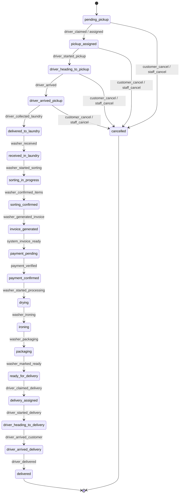

# Phase 2 — Order Lifecycle Hardening (State Machine & Transitions) Engineering Plan

## 1. Current Order Lifecycle Audit

### Actual Database Schema (`OrderStatus` enum in `prisma/schema.prisma`)
The system currently defines 20 discrete status values:
1. `pending_pickup`
2. `pickup_assigned`
3. `driver_heading_to_pickup`
4. `driver_arrived_pickup`
5. `delivered_to_laundry`
6. `received_in_laundry`
7. `sorting_in_progress`
8. `sorting_confirmed`
9. `invoice_generated`
10. `payment_pending`
11. `payment_confirmed`
12. `drying`
13. `ironing`
14. `packaging`
15. `ready_for_delivery`
16. `delivery_assigned`
17. `driver_heading_to_delivery`
18. `driver_arrived_delivery`
19. `delivered`
20. `cancelled`

### Audit of All Status Mutation Entry Points

| File | Function / Endpoint | Current Status | Target Status | Actor / Context | Isolation Check | Transaction? | Audit Logs & Events |
|---|---|---|---|---|---|---|---|
| `order.service.js` | `createOrder` | N/A | `pending_pickup` | Customer | `washerId` & `branchId` validated via `CoverageService` | Yes (`$transaction`) | `OrderEvent` written; `idempotencyKey` preserved |
| `order.service.js` | `updateWasherStatus` | Any | Client-specified `to` string | Washer Admin / Worker | `order.washerId === user.washerId` | Yes (`$transaction`) | `OrderEvent` written; `RealtimeOutboxEvent` written; Push sent outside TX |
| `order.service.js` | `updateDriverStatus` | Any | Client-specified `to` string | Driver / Washer Admin / Worker | `order.driverStaffMembershipId === user.staffMembershipId` | Yes (`$transaction`) | `OrderEvent` written; `RealtimeOutboxEvent` written; Push sent outside TX |
| `order.service.js` | `setOrderDetails` | `received_in_laundry` / `sorting_in_progress` | `sorting_confirmed` / `invoice_generated` | Washer Admin / Worker | `order.washerId === user.washerId` | Yes (`$transaction`) | `OrderEvent` written; `RealtimeOutboxEvent` written; Push sent outside TX |
| `order.service.js` | `customerCancel` | `pending_pickup`, `pickup_assigned`, `driver_heading_to_pickup`, `driver_arrived_pickup` | `cancelled` | Customer | `order.customerMembershipId === membership.id` | Yes (`$transaction`) | `OrderEvent` written; `DriverTask` cancelled; `RealtimeOutboxEvent` written; Push sent outside TX |
| `drivers.service.js` | `claimPickupTask` | `pending_pickup`, `accepted` | `pickup_assigned` | Driver / Washer Admin / Worker | `task.order.washerId === user.washerId` | Yes (`$transaction`) | `DriverTask.status = 'assigned'`, `OrderEvent` written, `RealtimeOutboxEvent` written |
| `drivers.service.js` | `claimDeliveryTask` | `washing`, `ready`, `ready_for_delivery` | `delivery_assigned` | Driver / Washer Admin / Worker | `task.order.washerId === user.washerId` | Yes (`$transaction`) | `DriverTask.status = 'assigned'`, `RealtimeOutboxEvent` written |
| `drivers.service.js` | `claimDeliveryByOrderId` | `washing`, `ready`, `ready_for_delivery` | `delivery_assigned` / unchanged | Driver / Washer Admin / Worker | `order.washerId === user.washerId` | Yes (`$transaction`) | `RealtimeOutboxEvent` written |
| `payment.service.js` | `createMoyasarPayment` | Any | `paymentStatus`: `paid`/`initiated`/`failed` | Customer | `order.customerMembershipId === membership.id` | Yes (`$transaction`) | `Payment` row created, `Invoice` updated, `RealtimeOutboxEvent` written |
| `payment.service.js` | `markOrderPaidManually` | Any | `paymentStatus`: `paid` | Washer Admin / Worker | `order.washerId === user.washerId` | Yes (`$transaction`) | `Payment` row created, `Invoice` updated, `RealtimeOutboxEvent` written |
| `payment.service.js` | `collectCashByDriver` | Any | `paymentStatus`: `paid` | Driver / Washer Admin / Worker | `order.driverStaffMembershipId === driver.id` | Yes (`$transaction`) | `Payment` row created, `Invoice` updated, `RealtimeOutboxEvent` written |

---

## 2. Canonical State Machine Specification

### Formal State Transition Table



### Actor & Permission Matrix

1. **`customer`**:
   - Allowed Transitions: `pending_pickup` / `pickup_assigned` / `driver_heading_to_pickup` / `driver_arrived_pickup` $\to$ `cancelled`.
   - Preconditions: Order belongs to customer's active membership for the canonical washer.
2. **`driver`**:
   - Allowed Transitions:
     - `pending_pickup` $\to$ `pickup_assigned` (claiming pickup task)
     - `pickup_assigned` $\to$ `driver_heading_to_pickup`
     - `driver_heading_to_pickup` $\to$ `driver_arrived_pickup`
     - `driver_arrived_pickup` $\to$ `delivered_to_laundry`
     - `ready_for_delivery` $\to$ `delivery_assigned` (claiming delivery task)
     - `delivery_assigned` $\to$ `driver_heading_to_delivery`
     - `driver_heading_to_delivery` $\to$ `driver_arrived_delivery`
     - `driver_arrived_delivery` $\to$ `delivered`
   - Preconditions: Driver holds active staff membership for the order's washer and branch, and task is assigned to driver.
3. **`washer_admin` / `worker` / `branch_manager`**:
   - Allowed Transitions:
     - `delivered_to_laundry` $\to$ `received_in_laundry`
     - `received_in_laundry` $\to$ `sorting_in_progress`
     - `sorting_in_progress` $\to$ `sorting_confirmed`
     - `sorting_confirmed` $\to$ `invoice_generated`
     - `payment_confirmed` $\to$ `drying`
     - `drying` $\to$ `ironing`
     - `ironing` $\to$ `packaging`
     - `packaging` $\to$ `ready_for_delivery`
     - Any active pre-washing status $\to$ `cancelled`
   - Preconditions: Staff member holds active staff membership for `order.washerId` and `order.branchId`.
4. **`system` / `payment_webhook`**:
   - Allowed Transitions: `invoice_generated` $\to$ `payment_pending` $\to$ `payment_confirmed`.

---

## 3. Centralized Order State Machine Engine (`OrderStateMachine`)

A centralized, strict state machine module will be created:
**`src/modules/orders/order-state-machine.js`**

### Signature:
```javascript
export function assertOrderTransition({
  order,
  targetStatus,
  actorContext,
  actionName,
  metadata = {}
})
```

### Core Responsibilities:
1. **Validates Current Status**: Throws `ApiError(400, 'invalid_transition')` if `order.status` $\to$ `targetStatus` is not explicitly permitted in the Canonical Transition Table.
2. **Validates Actor Authorization**: Enforces role and membership constraints for the specific transition.
3. **Enforces Washer & Branch Scoping**: Ensures `order.washerId === actorContext.washerId` and `order.branchId === actorContext.branchId`.
4. **Enforces Preconditions**: Validates business preconditions (e.g. driver task assignment, payment verification, item sorting completion).

---

## 4. Server Authority & Action-Based APIs

- Clients will **NEVER** send arbitrary status strings to mutate an order.
- Action-based methods (e.g., `claimPickup`, `confirmSorting`, `startProcessing`, `markDelivered`, `cancelOrder`) will map internally to strict state transitions inside `OrderStateMachine`.
- Existing HTTP endpoints (`PUT /api/orders/:id/washer-status`, `PUT /api/orders/:id/driver-status`) will route internally through `OrderStateMachine.executeTransition` to ensure zero breaking changes for existing mobile clients while enforcing server authority.

---

## 5. Branch & Washer Multi-Tenant Isolation

Every transition execution MUST re-verify:
```javascript
if (order.washerId !== actorContext.washerId) {
  throw new ApiError(403, 'forbidden', 'Washer context mismatch');
}
if (actorContext.branchId && order.branchId !== actorContext.branchId) {
  throw new ApiError(403, 'forbidden', 'Branch context mismatch');
}
```
Payload properties like `washerId` or `branchId` passed in HTTP request bodies are strictly IGNORED; canonical contexts extracted from verified tokens/memberships are enforced exclusively.

---

## 6. Driver Privileges & Task Isolation

- Drivers are constrained to tasks assigned to their `staffMembershipId`.
- Dual-role managers/admins acting as drivers MUST hold valid driver task assignments for the targeted order before executing driver status transitions.

---

## 7. Payment & Invoice Boundaries

- Order transition to `payment_confirmed` can ONLY occur via:
  1. Verified Moyasar webhook / payment provider callback (`PaymentService.createMoyasarPayment`).
  2. Verified cash collection by assigned driver (`PaymentService.collectCashByDriver`).
  3. Manual settlement by authorized washer admin (`PaymentService.markOrderPaidManually`).
- Clients cannot self-declare `payment_confirmed`.

---

## 8. Atomic Audit Trail (`OrderEvent`)

Every successful transition automatically creates an `OrderEvent` record within the SAME Prisma transaction:
```javascript
await tx.orderEvent.create({
  data: {
    orderId: order.id,
    from: order.status,
    to: targetStatus,
    byUserId: actorContext.identityId,
    staffMembershipId: actorContext.staffMembershipId || null,
    customerMembershipId: order.customerMembershipId || null,
    branchId: order.branchId,
    note: actionName || null,
    metadata: safeMetadata
  }
});
```

---

## 9. Transactional Push & Realtime Outbox Architecture

No direct Socket.IO or Firebase calls are made in the Order Service. All side-effects are queued inside the SAME Prisma transaction as Outbox events:
```javascript
await RealtimeOutboxService.safeCreateEvent(tx, {
  eventKey: `order-status-${order.id}-${targetStatus}-${Date.now()}`,
  eventType: 'order.status_updated',
  eventKind: 'client_event',
  aggregateType: 'Order',
  aggregateId: order.id,
  status: 'pending'
});
```
Push notifications and background workers process outbox events asynchronously. If the transaction rolls back, zero events are emitted.

---

## 10. Concurrency Protection Strategy

To prevent race conditions (e.g. concurrent cancel vs. sorting confirmation), transitions execute atomic conditional updates:
```javascript
const updated = await tx.order.updateMany({
  where: {
    id: order.id,
    status: currentStatus // Guard against concurrent status modification
  },
  data: {
    status: targetStatus,
    updatedAt: new Date()
  }
});
if (updated.count === 0) {
  throw new ApiError(409, 'CONCURRENCY_CONFLICT', 'Order status was modified by another transaction');
}
```

---

## 11. Idempotency Strategy

- Order creation idempotency via `idempotencyKey` and `contentHash` remains unchanged.
- Repeated transition requests with the same idempotency key return the original order state without creating duplicate `OrderEvent` or `Outbox` records.

---

## 12. Cancellation Policy & Business Rules

- **Allowed Cancellation Window**: `pending_pickup`, `pickup_assigned`, `driver_heading_to_pickup`, `driver_arrived_pickup`.
- **Forbidden Cancellation Window**: Once laundry is delivered to laundry (`delivered_to_laundry`) or in processing/sorting/ready/delivering states, customer cancellation is rejected with `order_cannot_be_cancelled` (HTTP 400).
- **Cancellation Side Effects**: Cancels open/assigned `DriverTask` records, writes `OrderEvent(to: 'cancelled')`, queues `RealtimeOutboxEvent`, and notifies staff/driver asynchronously.

---

## 13. Required Integration & Unit Test Matrix

1. **Happy Path Lifecycle**: End-to-end transition from `pending_pickup` $\to$ `delivered`.
2. **Forbidden Transition Rejection**: Direct status jump attempt (e.g. `pending_pickup` $\to$ `ready_for_delivery`) throws HTTP 400 `invalid_transition`.
3. **Backward Transition Rejection**: Reversing status (e.g. `ready_for_delivery` $\to$ `sorting_in_progress`) throws HTTP 400 `invalid_transition`.
4. **Washer Isolation Verification**: Washer B staff attempting status transition on Washer A order throws HTTP 403 `forbidden`.
5. **Branch Isolation Verification**: Branch B staff attempting status transition on Branch A order throws HTTP 403 `forbidden`.
6. **Driver Task Isolation**: Driver attempting status transition on unassigned task throws HTTP 403 `forbidden`.
7. **Customer Cancellation Boundaries**: Customer cancel succeeds in `pending_pickup`; fails in `delivered_to_laundry`.
8. **Concurrency Conflict Protection**: Concurrent transition attempts trigger single winner and clean rollback/409 for loser.
9. **Atomic Outbox Integrity**: Database rollback eliminates `OrderEvent`, `RealtimeOutboxEvent`, and `Notification` writes.

---

## 14. Files Subject to Modification in Phase 2
- `[NEW]` [src/modules/orders/order-state-machine.js](file:///Users/pro/Desktop/landryapp/laundry-nodejs-structure-v3/src/modules/orders/order-state-machine.js)
- `[MODIFY]` [src/modules/orders/order.service.js](file:///Users/pro/Desktop/landryapp/laundry-nodejs-structure-v3/src/modules/orders/order.service.js)
- `[MODIFY]` [src/modules/drivers/drivers.service.js](file:///Users/pro/Desktop/landryapp/laundry-nodejs-structure-v3/src/modules/drivers/drivers.service.js)
- `[MODIFY]` [src/modules/payments/payment.service.js](file:///Users/pro/Desktop/landryapp/laundry-nodejs-structure-v3/src/modules/payments/payment.service.js)
- `[NEW]` [src/tests/integration/order-state-machine.integration.test.js](file:///Users/pro/Desktop/landryapp/laundry-nodejs-structure-v3/src/tests/integration/order-state-machine.integration.test.js)

---

## 15. Schema & Migration Needs
- No schema changes or Prisma migrations required for Phase 2. The existing `OrderStatus` enum and models (`Order`, `OrderEvent`, `DriverTask`, `RealtimeOutboxEvent`) fully cover all required capabilities.

---

## 16. Definition of Done for Phase 2
1. `OrderStateMachine` module implemented and integrated into all order services.
2. All 20 order statuses constrained to formal transition rules.
3. Multi-tenant washer and branch isolation enforced on all transitions.
4. Comprehensive test suite (`order-state-machine.integration.test.js`) passing 100%.
5. Full backend regression test (`npm test`) passing 100% with 0 Open Handles.
6. `walkthrough.md` updated and presented for user review.
